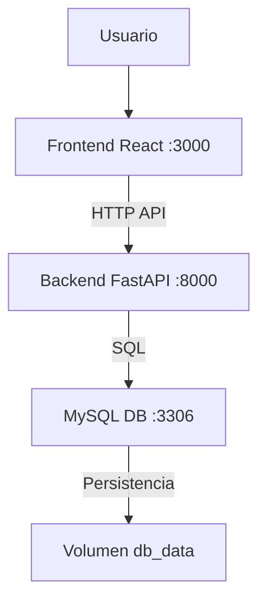

# Proyecto Microservicios Librería

**Autor:** Alessandra Guadalupe Ulloa Lopez
**Tecnologías:** Docker, Docker Compose, FastAPI, React, MySQL  

Este proyecto implementa una **arquitectura de microservicios** que integra:

1. **Frontend (React)**
2. **Backend (FastAPI)**
3. **Base de datos MySQL** con persistencia de datos

---

## 🏗 Arquitectura del proyecto

- **Frontend**: Consume la API del backend, muestra libros y permite operaciones CRUD.  
- **Backend (FastAPI)**: Gestiona la lógica de negocio, se conecta a la base de datos MySQL.  
- **Base de datos MySQL**: Almacena los libros con persistencia mediante volúmenes Docker.

### Diagrama de flujo de datos



---

## 📂 Estructura del proyecto

```
libreria-microservicios/
├─ frontend/
│  ├─ Dockerfile
│  └─ src/
├─ backend/
│  ├─ Dockerfile
│  ├─ main.py
│  └─ requirements.txt
├─ docker-compose.yml
├─ .env
└─ README.md
```

---

## ⚙️ Configuración de entorno

Crea un archivo `.env` en la raíz del proyecto con estas variables:

```env
# Base de datos
DB_USER=alessandra
DB_PASSWORD=lagartija
DB_HOST=db-ulloa
DB_PORT=3306
DB_NAME=db_ulloa_

# Datos personales
TUNOMBRE=Alessandra
TUAPELLIDO=Ulloa
```

> **Nota:** Si tu MySQL está directamente en EC2 y no en contenedor, usa su IP pública en `DB_HOST`.

---

## 🐳 Levantar los servicios con Docker Compose

Desde la raíz del proyecto:

```bash
docker compose up -d --build
```

Verifica que los contenedores estén activos:

```bash
docker ps
```

Deberías ver algo así:

| Contenedor       | Puerto |
|------------------|--------|
| frontend-ulloa   | 3000   |
| backend-ulloa    | 8000   |
| db-ulloa         | 3306   |

---

## 🌐 Probar la aplicación

- **Frontend:** [http://localhost:3000](http://localhost:3000)
- **Backend (Swagger):** [http://localhost:8000/docs](http://localhost:8000/docs)
- **Endpoint personalizado:** `GET /Ulloa` → devuelve `Alessandra Ulloa`

---

## 💾 Persistencia de datos

1. Crea un libro desde el frontend o mediante la API.
2. Reinicia los contenedores:

```bash
docker compose down
docker compose up -d
```

3. Verifica que los libros siguen ahí. ✅

Esto funciona porque `docker-compose.yml` define volúmenes explícitos para MySQL:

```yaml
volumes:
  db_data:
```

---

## 🔧 Comandos útiles

| Acción                          | Comando                                        |
|---------------------------------|------------------------------------------------|
| Levantar contenedores           | `docker compose up -d --build`                 |
| Detener contenedores            | `docker compose down`                          |
| Ver logs del backend            | `docker logs -f backend-ulloa`                 |
| Entrar al contenedor de MySQL   | `docker exec -it db-ulloa mysql -u alessandra -p` |
| Reiniciar backend               | `docker compose up -d --build backend-ulloa`   |

---

## 📈 Flujo de comunicación

1. Usuario accede al **frontend React**.
2. Frontend hace peticiones HTTP al **backend FastAPI**.
3. FastAPI ejecuta consultas a la **base de datos MySQL**.
4. MySQL devuelve los datos al backend.
5. Backend retorna la respuesta al frontend.

---

## 📂 docker-compose.yml

```yaml
version: "3.9"
services:
  db-ulloa:
    image: mysql:8.1
    environment:
      MYSQL_ROOT_PASSWORD: rootpass
      MYSQL_DATABASE: db_ulloa_
      MYSQL_USER: alessandra
      MYSQL_PASSWORD: lagartija
    ports:
      - "3306:3306"
    volumes:
      - db_data:/var/lib/mysql

  backend-ulloa:
    build: ./backend
    environment:
      DB_USER: alessandra
      DB_PASSWORD: lagartija
      DB_HOST: db-ulloa
      DB_PORT: 3306
      DB_NAME: db_ulloa_
      TUNOMBRE: Alessandra
      TUAPELLIDO: Ulloa
    ports:
      - "8000:8000"
    depends_on:
      - db-ulloa

  frontend-ulloa:
    build: ./frontend
    ports:
      - "3000:3000"
    depends_on:
      - backend-ulloa

volumes:
  db_data:
```

---

## ✅ Conclusión

Este proyecto demuestra un entorno completo de microservicios con:

- ✅ Persistencia de datos
- ✅ Red interna Docker
- ✅ Servicios independientes con Dockerfiles
- ✅ Interacción completa Frontend ↔ Backend ↔ Base de datos
- ✅ Pruebas de persistencia con volúmenes

---

**¡Proyecto completado! 🚀**
